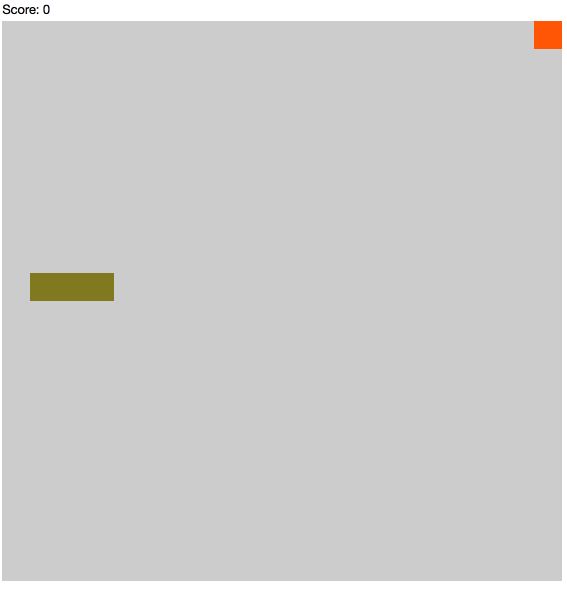

Reactive Snake
==============

A small and simple implementation of classic Snake game that showcases several frontend technologies.

The current version uses:
- [React](https://facebook.github.io/react/)
- [Bacon.js](https://baconjs.github.io/)
- [Flexbox](https://developer.mozilla.org/en-US/docs/Web/CSS/CSS_Flexible_Box_Layout/Using_CSS_flexible_boxes)
- [Underscore.js](http://underscorejs.org/)

Step-by-step tutorial
---------------------
You can create this app from scratch using [Reactive UI by example blog post](http://michalplachta.com/2016/05/11/reactive-ui-by-example/) as reference. Please checkout `workshop-init` branch when you want to do so.

Usage
-----
Do `npm install` and then `npm start`. To run tests, execute `npm test`.

Demo
----

Acknowledgements
-----
The application was created using [Create React App](https://github.com/facebookincubator/create-react-app).
